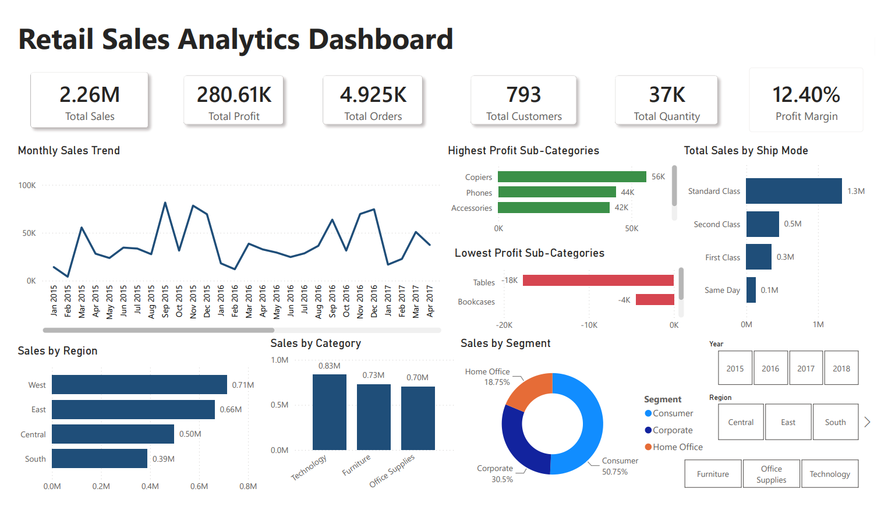

# Retail Sales Analytics Dashboard

## Overview

This project presents an interactive Power BI dashboard developed to analyze retail sales performance, profitability, customer segments, and regional trends using SQL, Power BI, and DAX.

The dashboard enables business users to monitor sales KPIs, evaluate regional performance, identify profitable product categories, and understand customer purchasing patterns.

---

## Tools Used

- SQL
- Power BI
- DAX

---

## Dashboard Features

- KPI Dashboard
- Monthly Sales Trend Analysis
- Regional Sales Analysis
- Category Performance
- Customer Segmentation
- Profit Analysis
- Shipping Mode Analysis
- Interactive Slicers

---

## Dashboard Preview

---

## Key Business Insights

- Technology generated the highest sales revenue.
- Copiers contributed the highest overall profit.
- Tables recorded the highest losses.
- Consumer segment generated the largest share of total sales.
- Standard Class accounted for the highest shipping revenue.

---

## Repository Contents

- Power BI Dashboard (.pbix)
- Dashboard PDF
- Dashboard Screenshot
- SQL Queries
